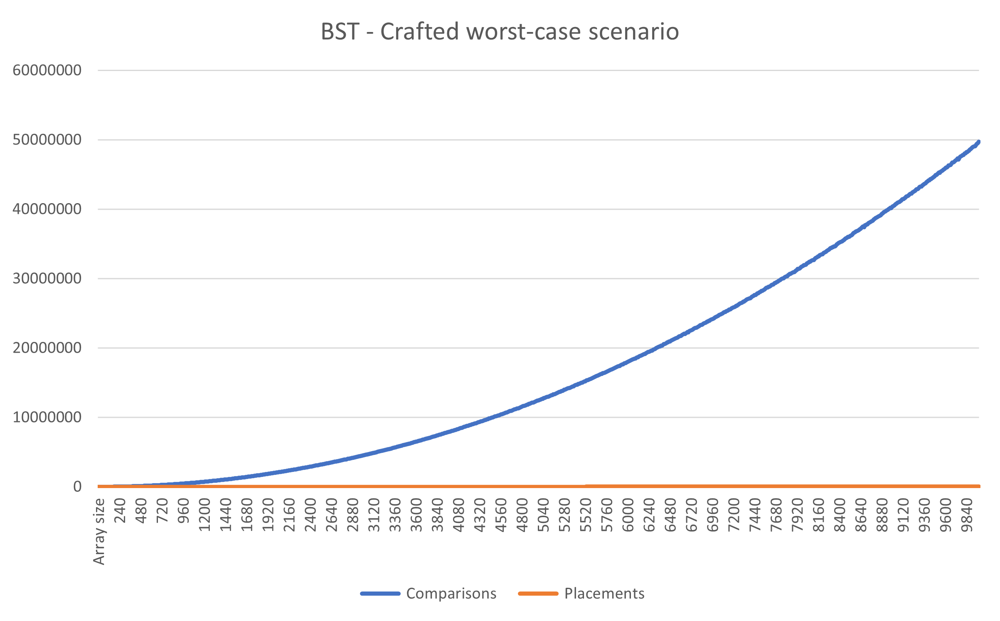

# Preface

In this project, we will examine the performance of various algorithms for counting unique values in an array.

# Measurements

We utilise three different metric values to measure the performance of each algorithm:

1. Number of comparisons conducted
2. Number of placements/copies
3. Number of "fixed-size" calculations

We use the third metric if hashtables are involved since we wish to consider the cost of hashing elements. That cost may be significant to performance no less than comparisons and placements.

Of course, the metric values themselves tell us nothing meaningful about comparing different algorithms for the same input size. That is because we do not know the relation between the cost of comparison, placement and hash calculation. Moreover, there are valuable metrics not included in this study, such as runtime, number of dynamic allocations, or overall memory requirements.

Nevertheless, measurements from this study will teach us about the asymptotic behaviour of different algorithms. That should help us grasp a strong intuition of which algorithms outperform others in the task.

# Technical notes

## Measurements 

The method employed to keep track of comparisons and placements was a crafted `Metered<T>` type. Thanks to C++'s rich type system, which provides fine-grained control over operators, the metered type overloads comparisons, placements, constructions, and copies. It counts all operations on the object.

The three counters (comparisons, placements, and fixed calculations) are accumulated in `MetricsCounter`, a static class whose only purpose is to store the live results.

Fixed calculations are just a fancy name for hash calculations and are implemented using the `logging_hash` type. More information about them can be found in the hashtable algorithm explanation.

## System data

**Compilation details:**

+ Compiler: Visual Studio C++ compiler (cl.exe)
+ Plaatform toolset: v142
+ Compiler flags: `/permissive- /ifcOutput "x64\Release\" /GS /GL /W4 /Gy /Zc:wchar_t /Zi /Gm- /O2 /sdl /Fd"x64\Release\vc142.pdb" /Zc:inline /fp:precise /D "NDEBUG" /D "_CONSOLE" /D "_UNICODE" /D "UNICODE" /errorReport:prompt /WX /Zc:forScope /Gd /Oi /MD /std:c++latest /FC /Fa"x64\Release\" /EHsc /nologo /Fo"x64\Release\" /Fp"x64\Release\CountUnique.pch" /diagnostics:column`

**Execution details:**

+ Operating system: Windows 10.0.19042
+ Processor: Intel64 Family 6 Model 140 Stepping 1 GenuineIntel ~2803 Mhz
+ Physical memory: 16,063 MB

# Algorithms

## 1. Original algorithm

**General:** This is the algorithm presented in Maman 12 Question 1(A). The algorithm arranges a subarray storing the unique values at the beginning of the original one. The algorithm iterates the unique subarray for every element in the array. It determines if the element has previously been encountered. Has it not been - it is appended to the unique subarray, and a counter is incremented.

**Performance:** The algorithm contains two nested loops - one for iterating the entire array and an inner loop that iterates the unique subarray for every element to look for it. In the worst-case, where every element is unique, the algorithm should perform $\Theta(n^2)$ comparisons to complete.

Considering the number of placements taking place, we observe that elements are copied when a new element is found. The line that performs element copies into the unique subarray is `*unique_end = *current;`. It happens in the outer loop, outside of the nested `range_contains` function. Therefore, the placement occurs at most $n$ times, and the placement number is then $O(n)$.

However, when we limit the range of known values, we know the maximum possible size of the unique subarray. Suppose the number of possible elements in the range is $m$. Thus, every inner iteration shall repeat no more than $m$ times, making the overall *worst-case* runtime complexity $\Theta(mn)$. When the range of generated values in the array is constant, the worst-case complexity becomes $\Theta(n)$.

Since the array values are numbers in the range $[1, 100]$, we can observe in the following metrics graph that the complexity is, in practice, linear!


<center>(1.1) - Original algorithms metrics graph: Orange - comparisons, grey - placements</center><br/>

If we generate the numbers in the range $[1, 10000]$ of sizes $N=[1,10000]$, we can see metrics that represent the average case where $m=\Theta(n)$. In that case, $\Theta(mn)$ is actually $\Theta(n^2)$. The following graph represents the collected data with the new ranges:


<center>(1.2) - Original algorithms metrics graph: Orange - comparisons, grey - placements</center>

An interesting phenomenon in this graph is that it "starts" as we intended but becomes linear for larger values. The reason is that when we reach larger array sizes, the array size $n$ comes close to the range $m$, and then recreating the previous case where $m=\Theta(n)$.

The following graph shows the intent. It represents the results of running the experiments with $N=[1,10000]$ and element range of $[1,1000000]$ (keeping $m>>n$ at all time). Here we can see a typical $\Theta(n^2)$ graph:


<center>(1.3) - Original algorithms metrics graph: Blue - comparisons, orange - placements</center>

Note that when the comparisons count goes quadratic (rather than linear), the placements count (which is linear) is negligible.

## 2. Insertion sort

**General:** Sort the array using insertion sort, then iterate it *once* and find all unique values. As we know all similar values reside in continuous "groups", when iterating the array, every time an element changes `array[i] != array[i-1]`, we know the new element `array[i]` is a new, unique element (which is not in `array[0...i-1]`). The routine `count_unique_in_ordered_array` counts the unique elements in exactly that manner.

**Performance:** Insertion sort is known to take $\Theta(n^2)$ steps in its worst and average cases, and `count_unique_in_ordered_array` always runs in $\Theta(n)$.

Examine the `insertion_sort` subroutine more deeply; we see an outer loop that iterates exactly $n$ times. Inside the loop, we call `first_larger`, which performs a binary search on `array[0...i-1]` to look for the first value larger than `array[i]` (that is the insertion point). The binary search takes $\Theta(\log(i))$ comparisons. After the insertion point is found, the array `array[insertion_point...i]` is rotated right one place (moving `array[i]`) into `array[insertion_point]`, and shifting every other element one place to the right. This procedure takes $\Theta(i-insertion\_point)$ placements. In the worst case, where the array is reversely-ordered, $insertion\_point$ will always be $0$, and the rotation will take $\Theta(i)$ placements.

In conclusion, as the outer loop executes $n$ times, the placements count in the worst case is $\sum_{i=1}^ni=\Theta(n^2)$. The comparison count is $\sum_{i=1}^n\log(i)=\log(n!)=\Theta(n\log(n))$.

The following graph shows the performance metrics of the insertion sort algorithm on array sizes from $10$ to $10000$.


<center>(2.1) - Insertion sort metrics graph: Blue - comparisons, orange - placements</center>

## 3. Optimal comparison-based sort

**General:** We used `std::sort` as an "optimal" comparison-based sort. The standard guarantees that this sort is optimal in the worst case:

```
Complexity

O(N·log(N)), where N = std::distance(first, last) comparisons. (since C++11)
```

After sorting the array, we use `count_unique_in_sorted_array` to count the unique values in a linear time.

**Performance:** Since an optimal sort should execute in no more than $O(n\log(n))$ steps, we expect the performance metrics to reflect that.

The following graph shows the comparisons and placements growth with array sizes of $10-10000$. Two additional lines are drawn: $f(x)=200x$ (yellow line) and $f(x)=73x\log(x)$ (grey line), to visually show that the comparisons&placements graph is not linear.


<center>(3.1) - Optimal sort metrics graph: Blue - comparisons, orange - placements, grey - nlgn, yellow - linear</center>

## 4. Heapsort

**General:** in addition to using `std::sort` (for it is known to be blazingly fast), I wanted to see the results of a known optimal sort. The library functions added in C++20, `std::make_heap` and `std::pop_heap`, rendered it very simple to implement heap sort.

After sorting the array, we use `count_unique_in_sorted_array` to count the unique values in a linear time.

**Performance:** Heapsort is known to take $\Theta(n\log(n))$ in its worst-case. By calling $MAX\_HEAPIFY$ on the heap, we perform up to $\log(n)$ comparisons and $\log(n)$ placements (swapping elements). Having $MAX\_HEAPIFY$ run $n$ times during the algorithm with decreasing heap size, the total number of comparisons/placements (after forming the heap for the first time) should be $\sum_{i=1}^n\log(i)=\Theta(n\log(n))$.


<center>(4.1) - Heap sort metrics graph: Blue - comparisons, orange - placements</center>

We observe more placements than comparisons generally because of the frequent swapping, which counts as three placements.

## 5. Counting sort C array

**General:** Uses a counting-sort-like table, except instead of holding counts, it holds booleans, with the meaning of "have we encountered this value before?". On every iteration, we check if the element is already in the presence table. If it is not, we add it and increment the unique count.

A disadvantage of this algorithm is that the range of values in the array must be known beforehand. Its memory complexity varies significantly with an increase of the possible value range.

**Performance:** We iterate the array $n$ times. Each time, we access the table once and make one comparison, and if the value is not in the table, one placement occurs. Of course, the maximum number of placements is the size of the value range in the array. Thus, the algorithm makes $\Theta(n)$ comparisons and $\Theta(m)$ placements in the worst-case ($m$ being the number of different values that may appear in the array).

Note: We do not count placements into the `unique_count` variable. The maximum amount of placements into this variable is $m$. Since we already count $\Theta(m)$ placements, extra $m$ placements do not affect the overall asymptotic behaviour.

The following graph visualises the growth in comparisons and placements:


<center>(5.1) - Counting sort array metrics graph: Blue - comparisons, orange - placements</center>

The above graph depicts the algorithm running with array sizes $10-10000$ and value range $[1...1000]$. When the array size is small, since $m>n$, we see that the number of placements grows with $n$, but the growth rate becomes smaller as the array size increases and $m$ stays constant.

However, when $m$ is constant, we assured that the number of placements is $\Theta(m)$, and should be $\Theta(1)$! Then, why is the graph linearly increasing and not constant? The answer lies in counting the first initialisation of the array for all algorithms. That initialisation takes $n$ placements and lower-binds the graph to $\Omega(n)$. Let us re-run this particular algorithm without measuring the initialisation:


<center>(5.2) - Counting sort array metrics graph, without measuring initialization: Blue - comparisons, orange - placements</center>

Exactly as expected.

## 6. Hash table

**General:** We use a hash table to store the values which were already counted as unique. On every iteration, we search the value in the table. If it is not found, we add it to the table and increment the unique elements counter.

We implement the hashtable by using `std::unordered_set`, since the MSVC STL implementation documents that `std::unordered_set` is internally implemented using a hashtable. We then use a specially designed hash type (replacing `std::hash<T>`), `logging_hash`, to measure the number of calls to the hash function. 

**Performance**: Here, we count the number of times the hash function is called since, depending on the hash function, it is reasonable to believe hash function calls may be a bottleneck in practice (making it a valuable metric).

`std::unordered_set` (and hash tables in general) offer a constant time search and insertion. Then, the number of comparisons, placements, and fixed calculations should be bounded from above by $O(n)$.

The following graph visualises the performance metrics for the hash table unique counter:


<center>(6.1) - Hash table metrics graph: Blue - comparisons, orange - placements, grey - hash calculations</center>

## 7. Binary Search Tree

**General:** Similarly to the hash table, the algorithm starts with an empty BST and iterates the array once. Every encountered element is searched in the tree. If it is not found, it is added to the tree, and a counter is incremented.

**Performance:** In the worst case, when the array is ordered, new leaves will always be added to the right. Then, a "tail" shaped tree will be formed (where $h=n$), with insertions and searches taking $\Theta(n)$ comparisons ($n$ being the size of the tree). Then, performing $n$ searches and $O(n)$ insertions, the algorithm overall runtime complexity should be $O(n^2)$.

However, a randomly generated input array should result in a randomly constructed BST, whose performance is predicted to be around the average case (and not the worst case). In the average case, we expect the tree's height to be logarithmic to the tree size - $h=\Theta(\log(n))$. Then, the overall number of comparisons is $\Theta(n\log(n))$. The number of placements is $\Theta(m)$ ($m$ being the maximal size of the tree)

The following graph depicts the metrics for the binary search tree:


<center>(7.1) - BST metrics graph: Blue - comparisons, orange - placements</center>

The comparisons count does not precisely reflect a "linear" growth. However, the yellow dashed line is a linear trendline emphasising that the comparisons grow linearly.

Similarly to algorithm 1, the limited constant range of possible elements in the array limits the BST size to a constant value, reducing the overall comparisons and placements from $\Theta(n\log(n))$ to $\Theta(n)$. With a broader range to work with, we should be able to observe a graph depicting $\Theta(n\log(n))$

The next graph depicts a crafted worst-case scenario. In this case, the generated arrays are always sorted, and the binary tree is always in its worst shape. That corresponds to $\Theta(n^2)$ comparisons and $\Theta(n\log(n))$ placements.



<center>(7.2) - BST worst-case metrics graph: Blue - comparisons, orange - placements</center>

The following graph corresponds to the average-case scenario, run with array sizes $10-10000$ and a value range of $[1...1000000]$ (thus, not limiting the tree size to a constant factor). This graph corresponds to the frequent case where $m=\omega(n)$ (an order of magnitude more values than actual elements).


<center>(7.3) - BST average-case metrics graph with $m=\omega(n)$: Blue - comparisons, orange - placements</center>

## 8. Red-Black Tree

**General:** This algorithm is similar to algorithm 7 (Binary Search Tree), but it uses a red-black tree. The algorithm implementation uses `std::set`, since the MSVC STL implementation states that it internally uses a red-black tree.

**Performance**: The height of the tree is guaranteed to be $\Theta(\log(n))$. When the values range is constant, like the previous case (BST), the overall number of comparisons is $\Theta(n)$. When the range is $m=\Omega(n)$, the overall number of comparisons is $\Theta(n\log(n))$.

The significant difference between the two algorithms is that the worst-case graph presented in the previous section does not exist here. The red-black tree height cannot be $\Theta(n)$, never allowing the overall number of comparisons in the algorithm to grow to $\Theta(n^2)$.

The following graphs depict two runs of the red-black tree algorithm, one with a small, limited range of possible values and one with an extensive range of values.


<center>(8.1) - Red-Black metrics graph: Blue - comparisons, orange - placements</center>


<center>(8.1) - Red-Black metrics graph, with value range $[1...1000000]: Blue - comparisons, orange - placements</center>

# Conclusions

We have witnessed that some algorithms behave better than others in terms of asymptotic behaviour. We learned that some algorithms take advantage of the restricted range of elements $[1...100]$.

However, we need to take the results from this succinct research with limited accountability. Many metrics are not measured here, such as runtime, the number of dynamic allocations, the number of CPU instructions, the memory requirements... Also, the array's minimal range implied a restriction on the runtimes and bound them to lower asymptotic growth rates. An extended version of this research should have included different ranges, different array types (truly random, sorted, k-sorted), and different random distributions (linear, Gaussian). All those factors may influence total performance. Thus, we cannot come up with factual conclusions without examining those aspects, too.

# Raw outputs:

Attached is a screenshot of a program execution and the raw output of different array sizes $N\in\{100,1000,10000,100000,1000000\}$:


```
N=100
Running with 1 Original algorithm
        Result: 62, Comparisons: 2756, Placements: 262, Calculations: 0
Running with 2 Insertion sort
        Result: 62, Comparisons: 627, Placements: 6787, Calculations: 0
Running with 3 Heap sort
        Result: 62, Comparisons: 802, Placements: 1064, Calculations: 0
Running with 4 Optimal sort
        Result: 62, Comparisons: 1109, Placements: 1230, Calculations: 0
Running with 5 Counting table
        Result: 62, Comparisons: 100, Placements: 325, Calculations: 0
Running with 6 Hash table
        Result: 62, Comparisons: 79, Placements: 224, Calculations: 170
Running with 7 Binary tree
        Result: 62, Comparisons: 1583, Placements: 162, Calculations: 0
Running with 8 Red-Black tree
        Result: 62, Comparisons: 970, Placements: 162, Calculations: 0
```

```
N=1000
Running with 1 Original algorithm
        Result: 101, Comparisons: 46909, Placements: 2101, Calculations: 0
Running with 2 Insertion sort
        Result: 101, Comparisons: 9589, Placements: 712168, Calculations: 0
Running with 3 Heap sort
        Result: 101, Comparisons: 11271, Placements: 13868, Calculations: 0
Running with 4 Optimal sort
        Result: 101, Comparisons: 11868, Placements: 11466, Calculations: 0
Running with 5 Counting table
       " Result: 101, Comparisons: 1000, Placements: 1303, Calculations: 0
Running with 6 Hash table
        Result: 101, Comparisons: 943, Placements: 1202, Calculations: 1173
Running with 7 Binary tree
        Result: 101, Comparisons: 14450, Placements: 1101, Calculations: 0
Running with 8 Red-Black tree
        Result: 101, Comparisons: 8349, Placements: 1101, Calculations: 0
```

```
N=10000
Running with 1 Original algorithm
        Result: 101, Comparisons: 509901, Placements: 20101, Calculations: 0
Running with 2 Insertion sort
        Result: 101, Comparisons: 128912, Placements: 74801431, Calculations: 0
Running with 3 Heap sort
        Result: 101, Comparisons: 146394, Placements: 172444, Calculations: 0
Running with 4 Optimal sort
        Result: 101, Comparisons: 107440, Placements: 88345, Calculations: 0
Running with 5 Counting table
        Result: 101, Comparisons: 10000, Placements: 10303, Calculations: 0
Running with 6 Hash table
        Result: 101, Comparisons: 9955, Placements: 10202, Calculations: 10173
Running with 7 Binary tree
        Result: 101, Comparisons: 125499, Placements: 10101, Calculations: 0
Running with 8 Red-Black tree
        Result: 101, Comparisons: 78488, Placements: 10101, Calculations: 0
```

```
N=100000
Running with 1 Original algorithm
        Result: 101, Comparisons: 5092129, Placements: 200101, Calculations: 0
Running with 2 Insertion sort
        Result: 101, Comparisons: 1622336, Placements: 7399179193, Calculations: 0
Running with 3 Heap sort
        Result: 101, Comparisons: 1796290, Placements: 2056625, Calculations: 0
Running with 4 Optimal sort
        Result: 101, Comparisons: 1067254, Placements: 919963, Calculations: 0
Running with 5 Counting table
        Result: 101, Comparisons: 100000, Placements: 100303, Calculations: 0
Running with 6 Hash table
        Result: 101, Comparisons: 99946, Placements: 100202, Calculations: 100173
Running with 7 Binary tree
        Result: 101, Comparisons: 1331265, Placements: 100101, Calculations: 0
Running with 8 Red-Black tree
        Result: 101, Comparisons: 792171, Placements: 100101, Calculations: 0
```

> **Note:** Insertion sort (algorithm #2) could not run with `N=1000000` in a reasonable amount of time. The experiment had to be stopped, and subsequently, the next run does not contain metrics for insertion sort.

```
N=1000000
Running with 1 Original algorithm
        Result: 101, Comparisons: 50948269, Placements: 2000101, Calculations: 0
Running with 3 Heap sort
        Result: 101, Comparisons: 21269739, Placements: 23874683, Calculations: 0
Running with 4 Optimal sort
        Result: 101, Comparisons: 10674645, Placements: 9474961, Calculations: 0
Running with 5 Counting table
        Result: 101, Comparisons: 1000000, Placements: 1000303, Calculations: 0
Running with 6 Hash table
        Result: 101, Comparisons: 999942, Placements: 1000202, Calculations: 1000173
Running with 7 Binary tree
        Result: 101, Comparisons: 13609646, Placements: 1000101, Calculations: 0
Running with 8 Red-Black tree
        Result: 101, Comparisons: 7929950, Placements: 1000101, Calculations: 0
```
